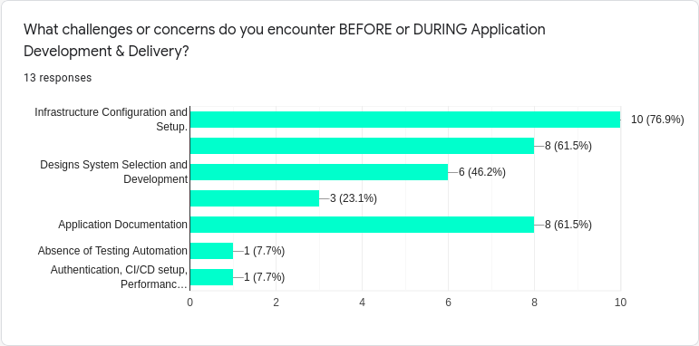
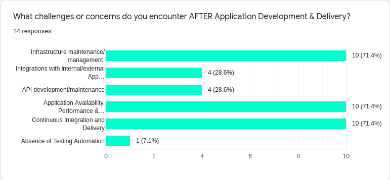
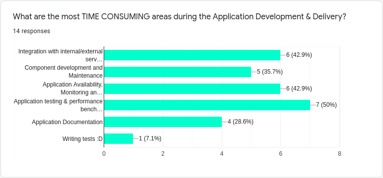
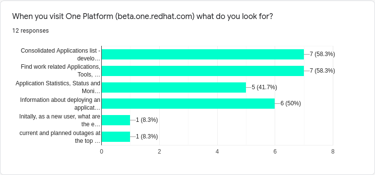
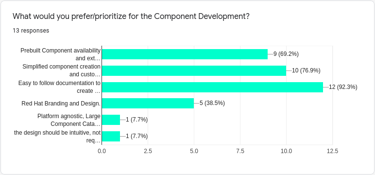

The One Platform team recently carried out a developers survey to:

- Determine the specific needs of developers and prioritize features & microservices development in the One Platform, and
- Add features to speed up the development, deployment, and delivery of the applications.

<!--truncate-->

In response we received some great feedback from all the participants of the survey that provided quite a significant amount of insight for the team about the requirements of application developers within the organization.

Based on these responses, the team was able to identify that during the application development lifecycle, the primary challenges faced by developers can be summarized as:

1. Infrastructure Configuration, Setup, maintenance, management is one of the top challenges faced by application developers across all stages of the application development cycle.
2. The second most notable challenge after the development cycle is around Application availability, visibility, documentation and performance.

The results from the survey were highly helpful to prioritize features and microservices that the team would be working on for the next phase of One Platform's development roadmap and accelerating the platform's application onboarding process. To this end, the upcoming releases of One Platform would be focussed upon improving the overall application onboarding process for developers with easily available documentation, quick application deployment, readily available platform integrations and high availability.

### Summary of the responses that were received

