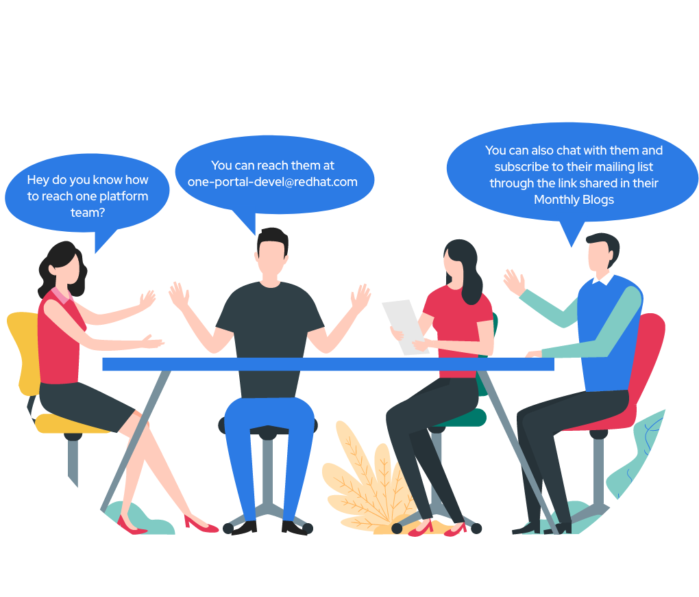

This is a summary of the development goals achieved by the _One Platform team_ in the month of **July** 2021.

<!--truncate-->

_This month, the strategy for the team was changed and the 4 weeks Sprint cycle was reduced to 2 Weeks cycle_. As part of two Sprints in July’21, One Platform Team had the following high-level goals which have been achieved as part of **113** **Jira** Issues closed by the Team.

- **Application Development**:
  - _Home Page_
    - Rebranding the home page as _Application hub._
    - Contact us page is updated with new team members data.
  - _Search_
    - Indexing native microservice data to Solr - Blocked testing on pre prod environments due to whitelisting of preprod environments in Akamai.
  - _API Catalog_
    - Collection of [Requirement](https://docs.google.com/spreadsheets/d/1Flk5hZRM7krzPInlTtfUGnJTN5ktfbyhonKAhEXxMiE/edit#gid=0)
    - Workflow creation to manage API Catalog with features like graphQL Playground/RESTful API Viewer/Swagger API Viewer
  - _Component Catalog _
    - Unified catalog listing component across Patternfly, OPC and Chapeaux
    - Technical conversation in progress. Requirement documents cover use cases for Phase I development.
  - _Innovation Hub_
    - UI development of Landing page.
    - UI implementation of Idea details page (title, description, total votes, option to vote etc.).
    - Create & update functionality fields for an Idea such as - Idea Summary and Description (user impact, value, audiences etc.).
    - _Production release tentatively on 31st Aug '21 date._
  - _Designs_
    - Re-defined the Designs for Search SPA, Notification SPA and Banner platform.
  - \_Continuous Integration & Deployment (CI/CD) automation - \_with pipeline for each in-built SPAs such as Notification SPA, User SPA, Feedback SPA etc.
  - Continuing SPAship operator onboarding for individual SPAs.
- **Platform Development**
  - _Developer Console_
    - App Settings page.
    - Integration with One Platform internal SPAs and the App Service.
    - App shell creation for Apps.
  - _Lighthouse CI Release and GA_
    - Created a homepage for easy testing of apps based on URL input.
    - Internal Property List Page.
    - Detailed analysis page for a SPA in a project.
    - Property-manager in service app.
    - Dashboard for showing the stats for Web properties.
    - Deployed Lighthouse backend to Openshift.
  - _GraphQL_
    - GraphQL federation support for microservices.
    - Deploy Graphql Portal in one platform.
- **Onboarding & Infrastructure update**
  - Attachment viewer - Development is In-progress.
  - _Escalation watchlist & Pantheon Onboarding_ - Conversations In-progress.
  - _One Platform Externally accessible (outside VPN)_ - Coordination In-progress with other teams such as - IT, Legal, InfoSec etc.
- **Non Native Apps**
  - **DSAL - Cost center tab release in DSAL Dashboard.**

### Up next in One Platform Store:

- Innovation hub GA release.
- App Development
- API Catalog Design and Backend.
- Component Catalog SPA.
- Lighthouse UI enhancements for better user experience.
- Developer Console adoption & enhancements.
- Reverse Proxy for upcoming experimental features.
- Notification framework and Banner configuration UI addition in Developer console.
- Explore GraphQL as a Managed Service.
- Whitelisting preprod environments in Akamai.
- One Platform readiness to be accessible outside VPN.

### Meta

**Completed Sprints:** OP – Jul'21 Mid Sprint, OP – Jul'21 End Sprint

**Ongoing/Upcoming Sprint:** OP – Aug'21 Mid Sprint

**One Platform:** [one.redhat.com](https://one.redhat.com)

**JIRA:** [https://issues.redhat.com/projects/ONEPLAT/issues](https://issues.redhat.com/projects/ONEPLAT/issues)

**GitHub:** [https://github.com/1-Platform/one-platform/issues](https://github.com/1-Platform/one-platform/issues)

### What is One Platform and How does it benefit our Stakeholders?

Link to the Blog [here](https://source.redhat.com/groups/public/exd-digital-experience-platforms/exd_digital_experience_platforms_dxp_blog/part_i_why_one_platform_to_host_your_applications) (Please check out all parts - I,II & III)

### How to Report Issues with One Platform team :

- **JIRA:** [https://issues.redhat.com/projects/ONEPLAT/issues](https://issues.redhat.com/projects/ONEPLAT/issues)
- **GitHub:** [https://github.com/1-Platform/one-platform/issues](https://github.com/1-Platform/one-platform/issues)

Please click on the below icons to - Chat, Raise questions with us and Subscribe to our mailing list.

|  |  Link to [FAQs](https://one.redhat.com/get-started/docs/faqs)  Link to [OKR](https://docs.google.com/spreadsheets/d/1L2shcuhCxVGUIFtWkh7Ft1ulNarq-zjatu-JqeONX4U/edit#gid=955345505) (Work In-Progress) |  |
| ----------------------------------------------------------------------------------------------------- | -------------------------------------------------------------------------------------------------------------------------------------------------------------------------------------------------------------------------------------------------------------------------------------------------------------- | ---------------------------------------------------------------------------------------------------------------------------- |
