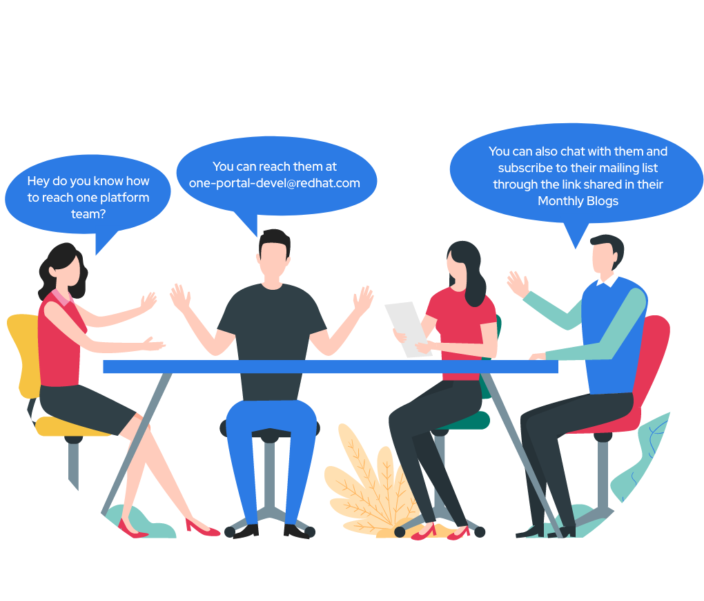

### Meta
**Completed Sprints:** OP – Aug'21 Mid Sprint, OP – Aug'21 End Sprint

**Ongoing/Upcoming Sprint:** OP – Sep'21 Mid Sprint

**One Platform:** [one.redhat.com](https://one.redhat.com)

**JIRA:** [https://issues.redhat.com/projects/ONEPLAT/issues](https://issues.redhat.com/projects/ONEPLAT/issues)

**GitHub:** [https://github.com/1-Platform/one-platform/issues](https://github.com/1-Platform/one-platform/issues)

### Introduction
This is a summary of the development goals achieved by the _One Platform team_ in the month of **August** 2021.

In the month of August’21, One Platform Team had the following high-level goals which have been achieved as part of **42 Jira** issues closed by the Team.

* **Application Development**:
    * _Search_
        * Indexed all the SPA home pages on Solr search collection
    * _API Catalog_
        * Initial POC is completed with the upstream tools like voyager & swagger
        * API tool is provisioned with the API configs in order to find and include the runtime support as per the user requirement
    * _Component Catalog _
        * Unified catalog listing component across Patternfly, OPC and Chapeaux
        * Technical conversation in progress. Requirement documents cover use cases for Phase I development
    * _Innovation Hub_
        * Tested deployment of couchdb to cloud with integration to Idea hub
        * Completed lighthouse CI requirements
    * _SSI_
        * App layout and Auth components are implemented
        * SSI Configuration / Selection page is implemented
    * _Designs_
        * Re-design the Banner, Notification, Alerts and Toasters pages
        * SPAship app metadata card modified in the Developer console
        * Enabled and configured database (couchdb) for apps in the Developer console
        * API Catalog Home page Design
        * Created unified workflow for API Catalog
        * Component Catalog Home and Listing page Design
    * _Continuous Integration & Deployment (CI/CD) automation - _All Pipelines are enhanced.
    * Published opc-menu-drawer, opc-nav & opc-notification-drawer to NPM
* **Platform Development**
    * _Database as a Service_
        * Couchdb and Reverse Proxy servers are deployed to QA and Stage environments
    * Toaster notification across the entire platform
    * _Developer Console_
        * App Settings page
    * _Lighthouse CI Release and GA_
        * Released first beta/alpha which is a consolidated place for the web properties score. This is integrated with the Lighthouse CI Server
* **Onboarding & Infrastructure update**
    * _Attachment viewer_ - Development is In-progress
    * _Escalation watchlist & IR Dashboard Onboarding_ - Conversations In-progress
    * _Pantheon Onboarding_ - Conversations In-progress
    * _One Platform Externally accessible (outside VPN)_ - Conversations In-progress

### Up next in One Platform Store: ###

* GA & Releases
    * Innovation hub GA release
    * Developer Console GA
    * API Catalog Phase 1 GA
    * Component Catalog Phase 1 GA
* App Development
    * API Catalog Design and Backend
    * Component Catalog SPA
    * Lighthouse UI enhancements for better user experience
    * Advanced use cases of Lighthouse Dashboard
        * Developer Console Integration
        * Dashboard Performance Improvements
        * Leaderboard development
* Couchdb and Reverse Proxy servers deployment to the Prod environment
* Notification framework and Banner configuration UI addition in Developer console
* Explore GraphQL as a Managed Service
* Whitelisting preprod environments in Akamai and to make new API URL accessible
* One Platform readiness to be accessible outside VPN
* One Platform integration with Rover and SNOW

### What is One Platform and How does it benefit our Stakeholders? ###
Link to the Blog [here](https://source.redhat.com/groups/public/exd-digital-experience-platforms/exd_digital_experience_platforms_dxp_blog/part_i_why_one_platform_to_host_your_applications) (Please check out all parts - I,II & III)

### How to Report Issues with One Platform team : ###

   * **JIRA:** [https://issues.redhat.com/projects/ONEPLAT/issues](https://issues.redhat.com/projects/ONEPLAT/issues)
   * **GitHub:** [https://github.com/1-Platform/one-platform/issues](https://github.com/1-Platform/one-platform/issues)

Please click on the below icons to - Chat, Raise questions with us and Subscribe to our mailing list.

| 	|  Link to [FAQs](https://one.redhat.com/get-started/docs/faqs)  Link to [OKR](https://docs.google.com/spreadsheets/d/1L2shcuhCxVGUIFtWkh7Ft1ulNarq-zjatu-JqeONX4U/edit#gid=955345505) (Work In-Progress)	|  	|
|---	|---	|---	|
