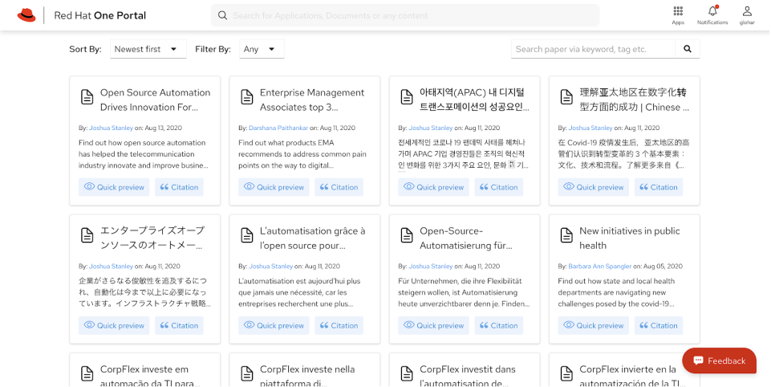
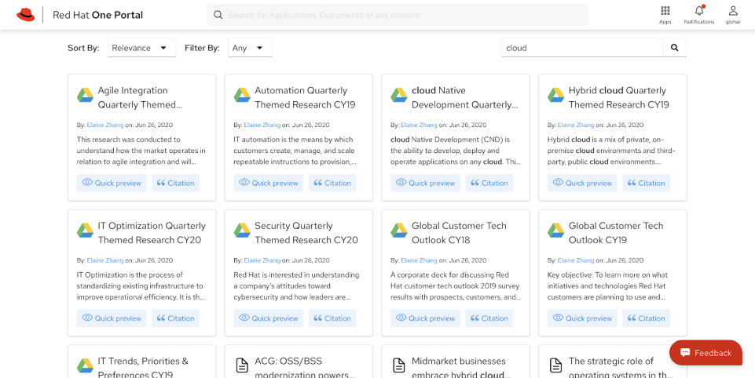
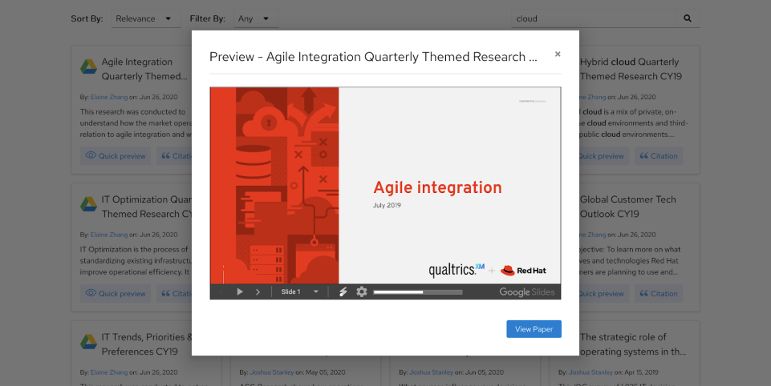
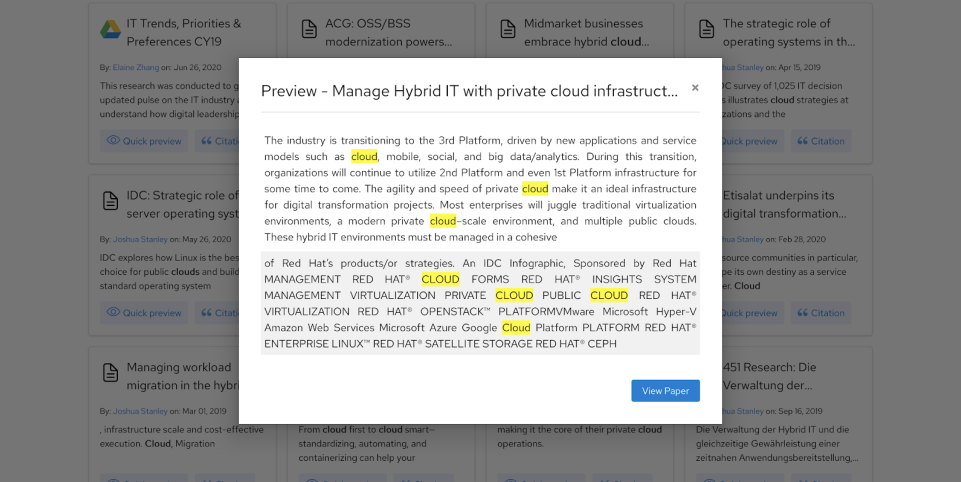

* * *

## For Users

### Introduction

Analyst Papers is a simple application that allows users to search through all the Analyst Materials stored in the PNT Portal and Google Drive. It provides full text search along with citation functionality.

### Supported Features

1. Full Text Search across PNT Portal and Google Drive
2. Citations as per Red Hat’s citation formats

### Get Started

Analyst Papers application provides the listing of the analyst papers stored in the PNT portal and Google Drive together. Users are able to search analyst material on the basis of the keyword provided and the application will list down the papers with the keyword highlighted in the title and description of the papers. Quick Preview helps the user identify the right content for them. Citation functionality lists out the copyable Red Hat citations for the users to put in anywhere they want the papers to be quoted.

### Target Audience

* Red Hat Marketing and Analyst Team.

### Other Details Pages

#### Landing Page

The Homepage for Analyst Papers App.

It shows the recently added documents in a grid view, with a search bar and some filters to sort and filter through the documents.

 

#### Search

When a user enters a search query in the search bar and submits, the app performs a search across PNT Portal and/or Google Drive (as per the selected filter), and shows the search results in a grid view and the search keywords are highlighted.

 

#### Quick Preview

* **Drive Papers**
   

* **PnT Papers**
   

### FAQs

* **Where is data/documents in the Analyst Papers coming from?**

    The Analyst Papers app has custom integrations with PNT Portal, and Google Drive which allows it to fetch and search for Analyst Papers documents.

    For PNT Portal, it searches the documents from the ‘Analyst Materials’ table. And for Google Drive, it performs the search in the "Researches in One Platform" shared folder.

* **How frequently is the data on the Homepage updated?**

    The Homepage shows the documents from a cache stored in the Analyst Papers backend. The cache is updated every day to check for new document additions/removals.

    But unlike the homepage, newly added documents are searchable almost immediately. So they show up in search even though it doesn’t show up on the homepage.

* **Analyst Papers Architecture**
    

## For Developers

### Component Contributors

1. Ghanshyam Lohar - [glohar@redhat.com](mailto:glohar@redhat.com)
2. Mayur Deshmukh - [mdeshmuk@redhat.com](mailto:mdeshmuk@redhat.com)
3. Sumeet Ingole - [singole@redhat.com](mailto:singole@redhat.com)

### Getting Started

Analyst Papers application provides the listing of the analyst papers stored in the PNT portal and Google Drive together. Users are able to search analyst material on the basis of the keyword provided and the application will list down the papers with the keyword highlighted in the title and description of the papers. Quick Preview helps the user identify the right content for them. Citation functionality lists out the copyable Red Hat citations for the users to put in anywhere

### Usage

#### Supported Features

1. Full Text Search across PNT Portal and Google Drive
2. Citation (as per Red Hat’s citation format)

### API Reference

#### Microservice

**Endpoint:** [https://analyst-papers-one-platform-qa.cloud.paas.psi.redhat.com/graphql](https://analyst-papers-one-platform-qa.cloud.paas.psi.redhat.com/graphql)

Analyst Papers Microservice provides a set of GraphQL Queries and Mutation APIs to allow developers to list and search Analyst Papers.

#### GraphQL Queries

| Query | Description |
| -------- | --------- |
| `listAnalystPapers`  | Returns a list of Analyst papers cached in MongoDB collection from PNT portal and Google Drive. Cache syncs up data from both the sources midnight daily. |
| `searchAnalystPapers` | Returns a list of searched Analyst Papers from PNT portal and Google Drive both. |
| `getPaperPreviewData` | Returns the previewable content(800 characters) for selected paper from the PNT portals. |

#### GraphQL Mutations

| Mutation | Description |
| -------- | --------- |
| `startAnalystPapersSync` | Starts the on demand sync of papers in cached MongoDB collection.  |
