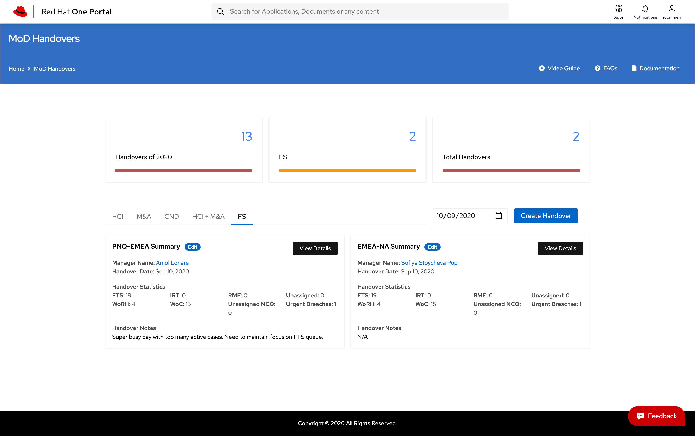
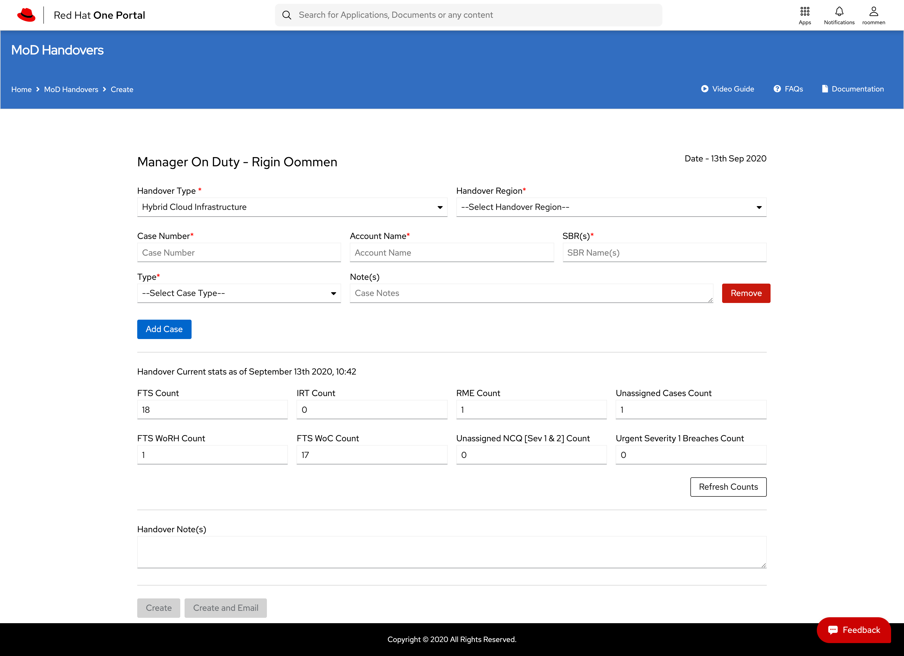
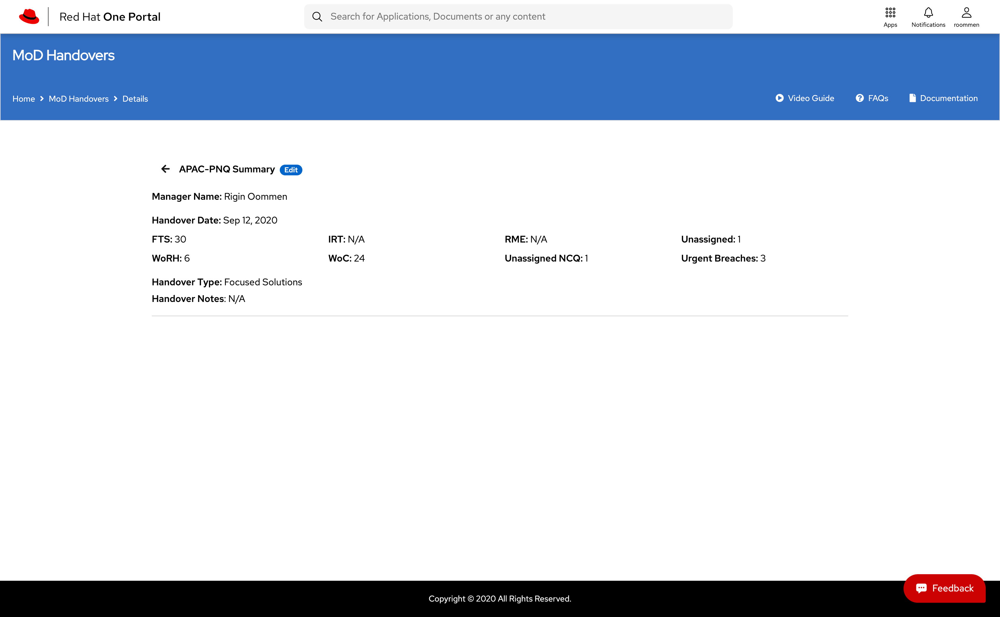

* * *
# MoD Handover SPA

## Developers

1. Rigin Oommen - [roommen@redhat.com](mailto:roommen@redhat.com)

## Getting Started

MoD Handover SPA stores and provides a view to all managers on duty handovers.

Handover tool supports five pillars in Support Delivery.

1. Hybrid Cloud Infrastructure (HCI)
2. Management and Automation (M&amp;A)
3. Cloud Native Development (CND)
4. Hybrid Cloud Infrastructure (HCI) &amp; Management and Automation (M&amp;A)
5. Focussed Solutions (FS)

### How to access Handover tool
1. https://beta.one.redhat.com/mod-handovers/

### Screenshots
1. Home Page



2. Creation/Editing the Handover



3. Handover Details Page




## Usage

### Introduction

This SPA is integrated with the MoD Handovers Microservice which is integrated with the SFDC for obtaining current stats.

### Supported Features

1. Storing handovers
2. Sending Email to the Leadership about handover updates

#### Microservices used by this SPA

1. MoD Handover Microservice

### Developer Guide

Prerequisites

1. **NodeJS** should be installed (_version\&gt;=__v10.15.3_)
2. **NPM** should be installed _(version\&gt;= __6.4.1__ )_
3. Version control system required. Preferably **git**.
4. **Angular CLI** needs to be installed

Steps

1. Clone the [repository](https://gitlab.cee.redhat.com/one-portal/mod-handovers).
```sh
https://gitlab.cee.redhat.com/one-portal/mod-handovers
```

1. Switch the working directory to the user microservice
```sh
cd one-platform/packages/user-profile-spa
```
1. Install the dependencies.
```sh
npm i
```
Start

1. Run npm run start to run your spa for dev env
2. Navigate to port 4200 to see the running app.

eg: http://localhost:4200

Build

1. [Webpack](https://webpack.js.org/) is used for the build system in the microservices.
2. Run ```npm run build``` to generate a build

Testing

1. For testing microservice with [jest](https://jestjs.io/) with the preconfigured settings.
2. Execute the command for testing.
```sh
npm run test
```
