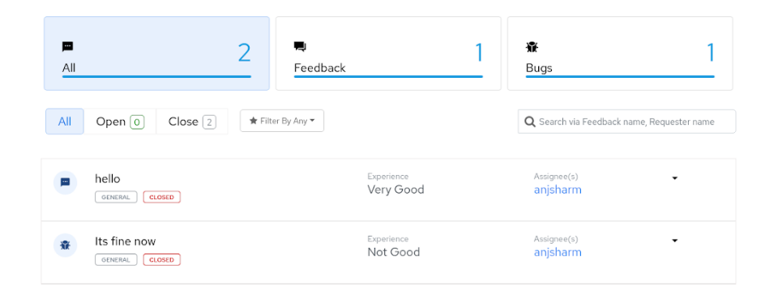
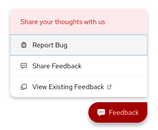

* * *

## Developers

### Component Contributors

1. Anjnee Sharma - [anjsharm@redhat.com](mailto:anjsharm@redhat.com) - [anjneeksharma (Anjnee Sharma) · GitHub](https://github.com/anjneeksharma)

### Getting Started

Feedback-spa is a landing page for already existing feedback and bugs users can search bugs here using many filters.

### Usage

#### Introduction

Feedback-SPA is a landing page for all feedback/bugs, those are created around a platform they can be filtered based on many filters like feedback title, feedback name, status, description and type.

#### Supported Features

1. List all feedback.

2. Filter feedback on the listing page.

3. Create new feedback.

4. Users can check the status of submitted feedback.

#### Quick Start Guide

Follow these steps to setup feedback-spa in your local environment:

1. Clone or download project from the one-platform repo [https://github.com/1-Platform/one-platform](https://github.com/1-Platform/one-platform)

2. `cd one-platform/packages/feedback-spa`

3. `ng build`

4. `ng serve`

5. Access <https://localhost:4200/feedback/> from your preferred browser.

### API Reference

For api reference access feedback-service document, feedback-service is backend for feedback-spa

<!-- The API reference details can be found at the [Feedback Microservice Documentation](/microservices/feedback/feedback-microservice). -->

## FAQs

* **How can I access feedback-spa ?**

    [https://localhost:4200/feedback/](https://localhost:4200/feedback/)

* **Does the feedback-spa have any dependency to access it ?**

    Yes you would need to start the feedback-microservice.

* **How can I create new feedback ?**

    From any One Platform page's bottom right  corner, you can use the feedback button.
    

* **How can I access existing feedback ?**

    From any One Platform page's bottom right  corner, click the feedback button and then the ***View Existing feedback*** option.
    
