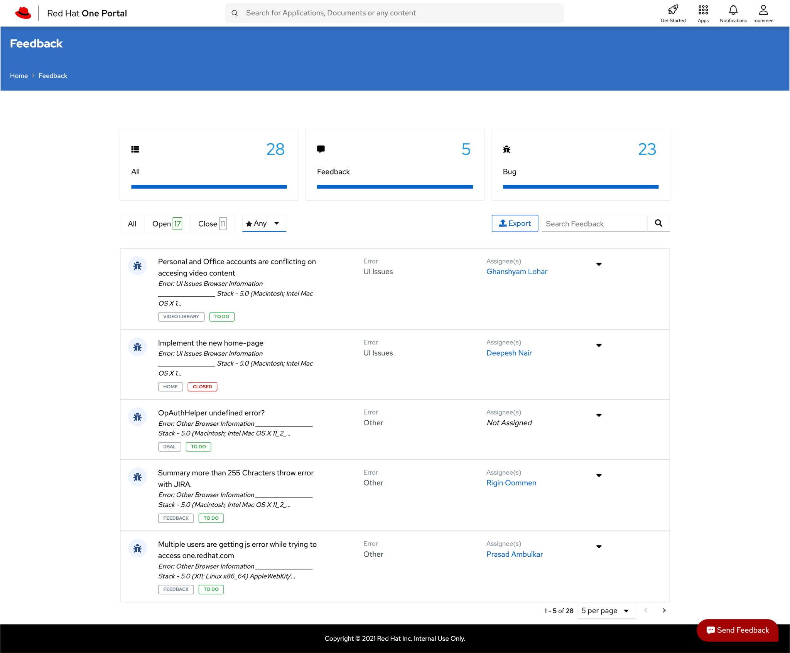
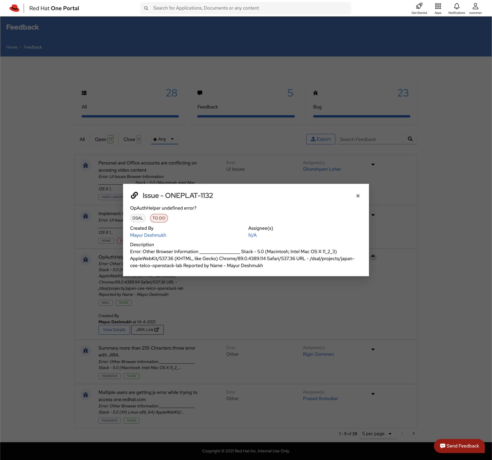

## Developers

### Component Contributors

1. Rigin Oommen - [roommen@redhat.com](mailto:roommen@redhat.com) - [riginoommen (Rigin Oommen) · GitHub](https://github.com/riginoommen)

## Getting Started

Feedback Application is the interface which have the view of the feedback & bug reports submitted by the users.

#### Supported Features

1. List all feedbacks/bugs.

2. Filter feedback/bugs on the listing page.

3. Users can check the status of submitted feedbacks/bugs.

## Quick Start Guide
### Prerequisites

1. **NodeJS**  should be installed (*version>=**v10.15.3*)
2. **NPM** should be installed *(version>=**6.4.1**)*
3. Version control system required. Preferably **git**.
4. **Vue CLI** needs to be installed
### Steps

1. Clone the [repository](https://github.com/1-Platform/one-platform).

 ```sh
 git clone git@github.com:1-Platform/one-platform.git
 ```

2. Switch the working directory to the user  microservice

 ```sh
 cd one-platform/packages/feedback-spa
 ```

3. Install the dependencies.

 ```sh
  yarn install
 ```
### Start

1. Run ```yarn serve``` to run your spa for dev env
2. Navigate to port 4200 to see the running app.
 eg: `http://localhost:4200`
### Build

1. [Webpack](https://webpack.js.org) is used for the build system in the microservices.
2. Execute ```yarn build ``` to generate a build
### Testing

1. For testing microservice with [jest](https://jestjs.io/) with the preconfigured settings.

    #### Unit Tests
    ```sh
    yarn test:unit
    ```
    #### E2E tests
    ```sh
    yarn test:e2e
    ```

### API References
Visit [Feedback Microservice](/docs/microservices/feedback-service) documentation for API references
## FAQs

<details>
<summary>How to submit a feedback/bug?.</summary>
Feedback can be submitted through <a href="https://www.npmjs.com/package/@one-platform/opc-feedback">opc-feedback</a>webcomponent only. SPA does n't have the functionality to create a new SPA.
</details>
<details>
<summary>Can i update the feedback here?.</summary>
No. Thats possible only with the integration(Jira/GitHub/GitLab) supported for that feedback/bug?
</details>

## Screenshots

1. Home Page


2. Details View

