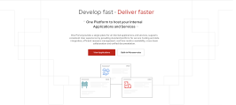
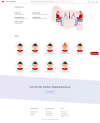
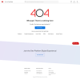

* * *

## Target Audience

1. SPA Owners for One Platform
2. SPA Users for One Platform

## Developers

### Component Contributors

1. Deepesh Nair - [denair@redhat.com ](mailto:denair@redhat.com ) - [hybridx (Deepesh Nair) · GitHub](https://github.com/hybridx)
2. Sumit Ingole - [singole@redhat.com](mailto:singole@redhat.com) - [gisumit (Sumit Ingole) · GitHub](https://github.com/gisumit)

### Getting Started

The Home-SPA is the landing page for One Platform. Here you can view applications in spotlight and also built in microservice.



### Usage

#### Development Server

* Clone the project from [https://github.com/1-Platform/one-platform](https://github.com/1-Platform/one-platform)

    ```sh
    git clone git@github.com:1-Platform/one-platform.git
    ```

* Go to the home-spa folder

    ```sh
    cd one-platform/packages/home-spa/
    ```

* Rename `.env.example` to `.env`
* Add URL to API_URL in .env file (API_URL=[https://example.com/graphql](https://example.com/graphql))
  * Application requires following schema

    ```js
        name: 'Name/Title'
        description: 'Description of the entity',
        link: 'Link to entity'
        icon: 'Icon for the entity',
        entityType: 'Spa/Microservice',
    ```

* Run development server

    ```sh
    npm run dev
    ```

## Other Details Pages

* Contact Us
    

* 404
    

## FAQs

* **What is the home-spa?**

    A landing page for One Platform

* **What are Applications on Spotlight?**

    Only the most trending applications are in applications in the spotlight.
