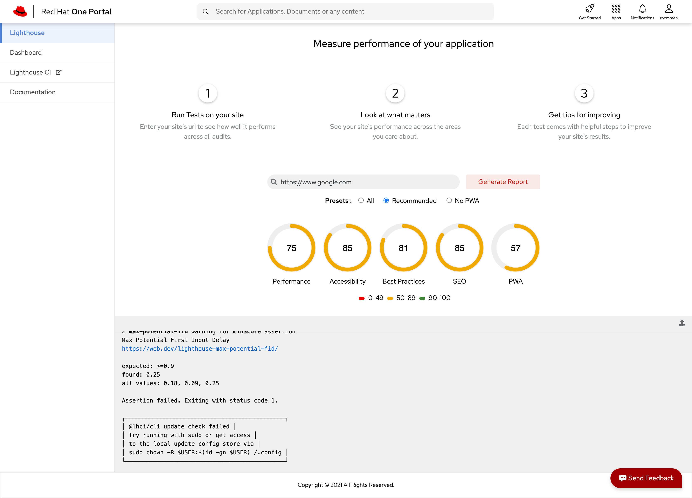

* * *

## Developers

1. Akhil Mohan - [akmohan@redhat.com](mailto:akmohan@redhat.com) - [akhilmhdh (Akhil Mohan) · GitHub](https://github.com/akhilmhdh)
2. Rigin Oommen - [roommen@redhat.com](mailto:roommen@redhat.com) - [riginoommen (Rigin Oommen) · GitHub](https://github.com/riginoommen)

## Getting Started

Lighthouse SPA provides the interface to test a webproperty performance. It consist of a dashboard which shows a consolidated view of the apps.

## Usage

### Introduction

This SPA is integrated with the Lighthouse Microservice for performing the audits of a web property. This spa is built with Angular.

### Supported Features

1. Perform the lighthouse audit for a web property

2. Consolidated Dashboard for listing the scores for multiple apps.

### Microservices used by this SPA

1. Lighthouse Microservice

### Quick Start Guide

**Prerequisites**

1. **NodeJS**  should be installed (*version>=**v14.15.4*)
2. **NPM** should be installed *(version>=**6.14.10**)*
3. Version control system required. Preferably **git**.
4. **Angular CLI** needs to be installed

**Steps**

1. Clone the [repository](https://github.com/1-Platform/one-platform).

 ```sh
 git clone git@github.com:1-Platform/one-platform.git
 ```

2. Switch the working directory to the lighthouse microservice

 ```sh
 cd one-platform/packages/lighthouse-spa
 ```

3. Install the dependencies.

 ```sh
  npm i
 ```

**Environment Variables**
```sh
export API_URL='http://localhost:8080/graphql'
export WS_URL='ws://localhost:8080/subscriptions'
export LH_SERVER_URL='http://lighthouse.example.com'
````

**Start**

1. Run `npm start` to run your spa for dev env
2. Navigate to port 4200 to see the running app.
 eg: `http://localhost:4200`

**Build**

1. [Webpack](https://webpack.js.org) is used for the build system in the microservices.
2. Run `npm build:prod` to generate a build

**Testing**

1. For testing microservice with [jest](https://jestjs.io/) with the preconfigured settings.
2. Execute the command for testing.

 ```sh
 npm test
 ```

### Screenshots

