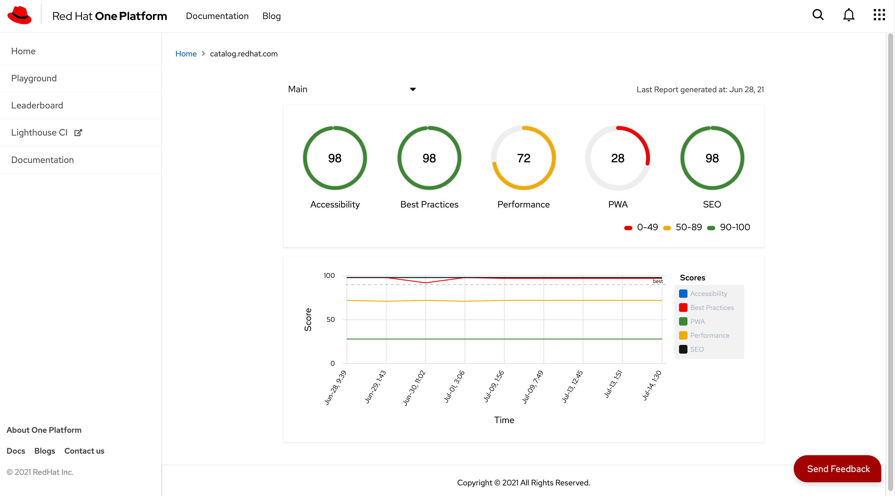
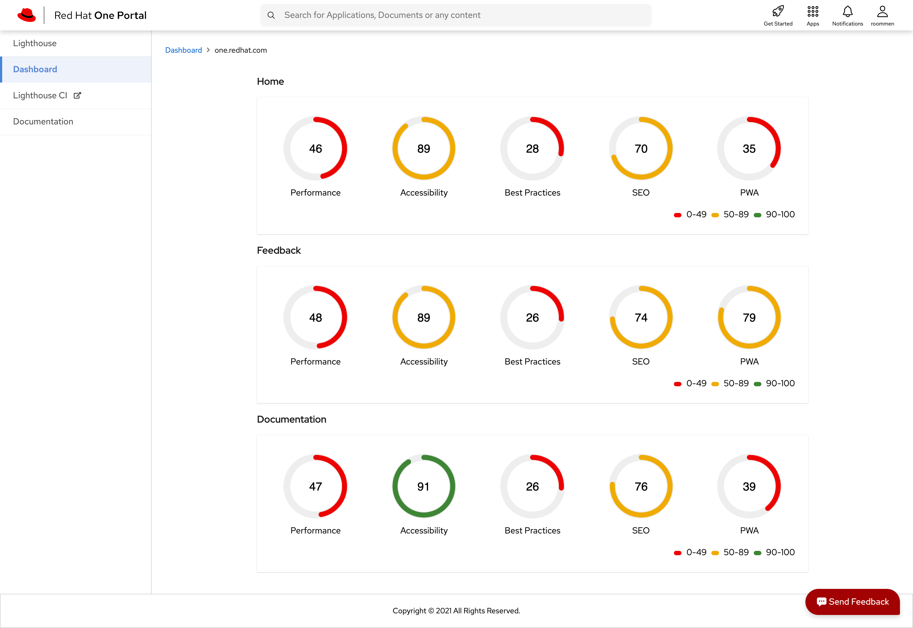
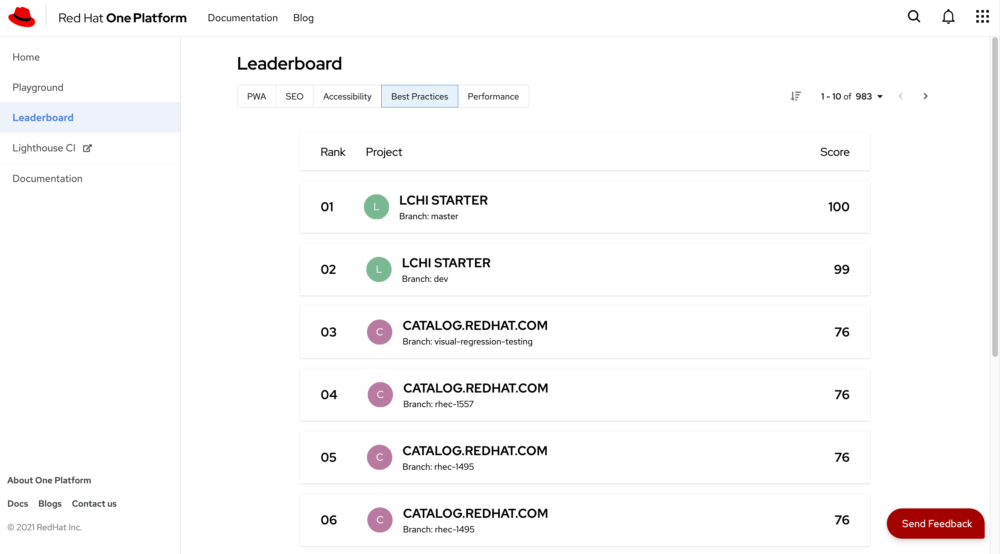

---

## Getting Started

Lighthouse SPA provides the interface to test a webproperty performance. It consist of a dashboard which shows a consolidated view of the apps.

Refer to [Lighthouse Service](/docs/microservices/lighthouse-service)  for api references.

## Usage

### Introduction

This SPA is integrated with the Lighthouse Microservice for performing the audits of a web property. This spa is built with Angular.

### Supported Features

1. Perform the lighthouse audit for a web property

2. Consolidated Dashboard for listing the scores for multiple apps.

3. A leaderboard that ranks based on the project's scores.

### Microservices used by this SPA

1. Lighthouse Microservice

### FAQs

**How to test a web property?.**

There are two ways to test a web property with Lighthouse CI

- CI/CD Pipelines

  With CI/CD pipelines you can perform the test with the web properties

  Refer [Ci Configuration Guide](https://github.com/GoogleChrome/lighthouse-ci/blob/main/docs/configuration.md)

- Lighthouse SPA _(beta)_

  #### Testing

  The webui allows you to test the web property with the assertion standards offered by the lighthouse. It also support uploading the lighthouse report to the CI server.

  1. _lighthouse:recommended_
  1. _lighthouse:all_
  1. _lighthouse:no-pwa_

  #### Dashboard

  Lighthouse SPA also provides the consolidated view of the spa and the scores which results from the audits performed.

### Quick Start Guide for Developers

**Prerequisites**

1. **NodeJS** should be installed (_version>=\*\*v14.15.4_)
2. **NPM** should be installed _(version>=**6.14.10**)_
3. Version control system required. Preferably **git**.
4. **Angular CLI** needs to be installed

**Steps**

1. Clone the [repository](https://github.com/1-Platform/one-platform).

```sh
git clone git@github.com:1-Platform/one-platform.git
```

2. Switch the working directory to the lighthouse microservice

```sh
cd one-platform/packages/lighthouse-spa
```

3. Install the dependencies.

```sh
 npm i
```

**Environment Variables**

```sh
export API_URL='http://localhost:8080/graphql'
export WS_URL='ws://localhost:8080/subscriptions'
export LH_SERVER_URL='http://lighthouse.example.com',
export LH_CONTACT_MAIL='one-platform-devs@redhat.com',
export OPCBASE_API_BASE_PATH='http://localhost:8080/graphql',
export OPCBASE_SUBSCRIPTION_BASE_PATH='ws://localhost:8080/subscriptions',
export OPCBASE_KEYCLOAK_URL='https://keyclock.example.com',
export OPCBASE_KEYCLOAK_CLIENT_ID='keyclock-id',
export OPCBASE_KEYCLOAK_REALM='keyclock-realm',
```

**Start**

1. Run `npm start` to run your spa for dev env
2. Navigate to port 4200 to see the running app.
   eg: `http://localhost:4200`

**Build**

1. [Webpack](https://webpack.js.org) is used for the build system in the microservices.
2. Run `npm build:prod` to generate a build

**Testing**

1. For testing microservice with [jest](https://jestjs.io/) with the preconfigured settings.
2. Execute the command for testing.

```sh
npm test
```

### Screenshots

1. Home Page
   

2. Dashboard View
   

3. Scores View
   

4. Leaderboard View
   

## Developers

1. Akhil Mohan - [akmohan@redhat.com](mailto:akmohan@redhat.com) - [akhilmhdh (Akhil Mohan) · GitHub](https://github.com/akhilmhdh)
2. Rigin Oommen - [roommen@redhat.com](mailto:roommen@redhat.com) - [riginoommen (Rigin Oommen) · GitHub](https://github.com/riginoommen)
