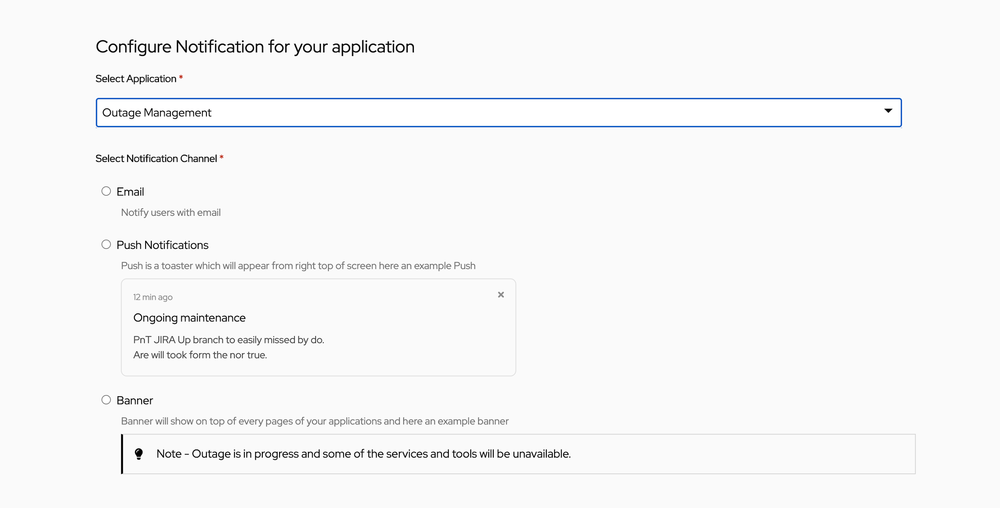
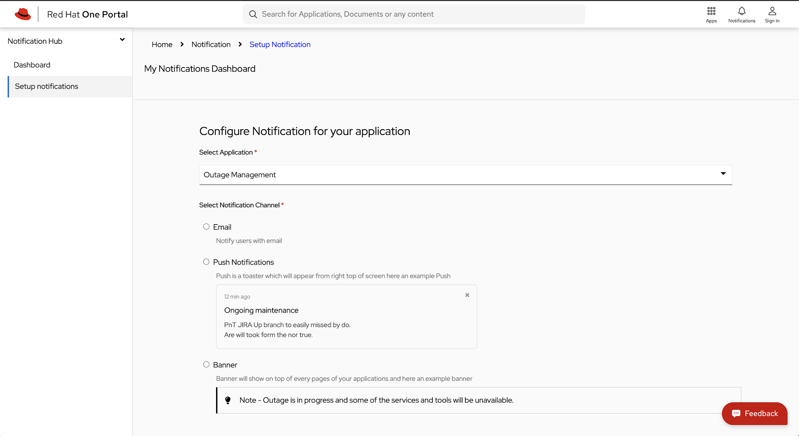
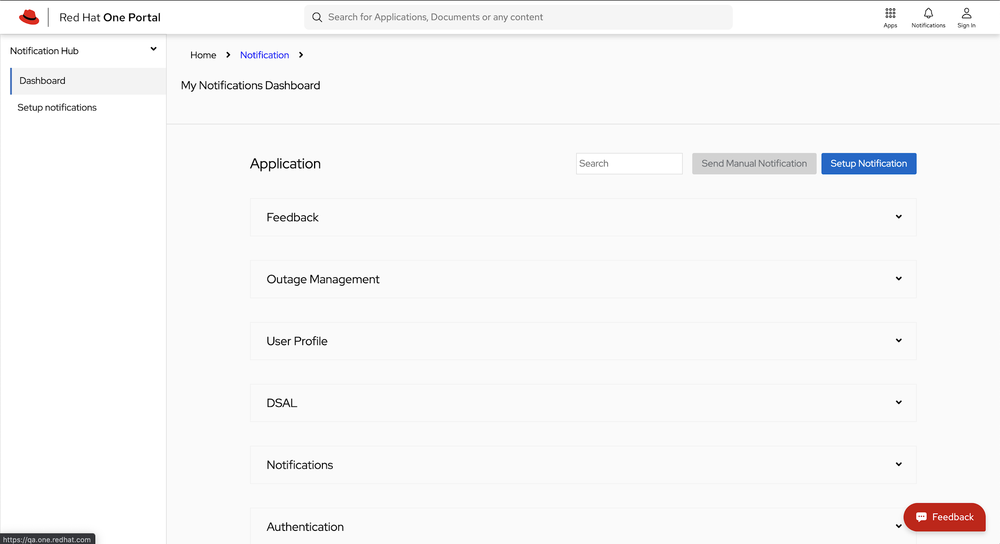

* * *

## Target Audience

* SPA Developers for One Platform

* SPA Owners for One Platform

* SPA Users for One Platform

## Developers

### Component Contributors

1. Deepesh Nair - [denair@redhat.com](mailto:denair@redhat.com) - @Github  [https://git.io/dnair](https://git.io/dnair)

2. Sumeet Ingole - [singole@redhat.com](mailto:singole@redhat.com) - @Github [https://github.com/gisumit/](https://github.com/gisumit/)

### Getting Started

The Notification Management Dashboard enables SPA-owners to create multiple notification templates for their Applications. It also allows the SPA owners to manage different notification types, such as Email, pop-up, and Banner notifications.

### Usage

#### **Development server**

* Clone the project from [https://github.com/1-platform/one-platform](https://github.com/1-platform/one-platform)

  ```sh
  git clone git@github.com:1-Platform/one-platform.git
  ```

* Go to the home-spa folder

  ```sh
  cd one-platform/packages/notifications-spa/
  ```

* Rename `.env.example` to `.env`.

* Add URL to API_URL in .env file (API_URL=[https://example.com/graphql](https://example.com/graphql))

  * Application requires following schema

* Start development server

  ```sh
  npm run start
  ```

* Run test cases

  ```sh
  npm run test
  ```

### Supported Features

* Create notification
  * To create a new notification
    * Go to`notifications/manage/new`
      * You should be able to see a screen like below
          
      * Here you can
        * Select a Notification Channel
          * Email
          * Push notification
          * Banner
        * Select a Notification Trigger
          * Scheduled
          * Triggered Notification
        * Add notification target names
* Edit notification
  * Here you can
    * Select a Notification Channel
      * Email
      * Push notification
      * Banner
    * Select a Notification Trigger
      * Scheduled
      * Triggered Notification
    * Add notification target names
* Delete notification
  * Delete a notification by ID

### API Reference

The following are the APIs that are being used by the Notification-SPA. All the queries are graphql queries

* Fragment used for notification-spa for notification-service

```js
fragment notification on NotificationConfigRaw {
 id
 configID
 template
 defaultLink
 channel
 type
 action
 targets
 source {
   _id
   name
   icon
   active
   owners {
     _id
     name
   }
 }
 createdBy
 createdOn
 updatedBy
 updatedOn
}
```

* Fragment used for home-service

```js
fragment home on HomeType {
 _id
 name
}
```

* API used for creation of a notification configuration

```js
mutation CreateNotificationConfig($input: NotificationConfigInput!) {
 createNotificationConfig(notificationConfig: $input) {
   ...notification
 }
}
```

* API used updating notification configuration

```js
mutation UpdateNotificationConfig($input: NotificationConfigInput!) {
 updateNotificationConfig(notificationConfig: $input) {
   ...notification
 }
}
```

* API used to delete notification config

```js
mutation DeleteNotificationConfig ($id: String!) {
 deleteNotificationConfig(id: $id) {
   ...notification
 }
}
```

#### Microservices being used by the Application

1. Notification Microservice

2. Home Microservice

### Other Details Pages

 

 

## FAQs

* **What is notification-spa?**

  The Notification Management Dashboard enables SPA-owners to create multiple notification templates for their Applications. It also allows the SPA owners to manage different notification types, such as Email, pop-up, and Banner notifications.

* **I am a SPA-Owner. How will it help me?**

  You can create a notification (recurrent/non-recurrent) for you users in the form of a banner, pop-up or email which would help your users get notified of (example)  a new feature, deprecations or trigger based events which could be linked to an Outage for your SPA
