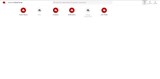
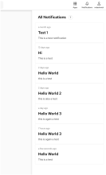
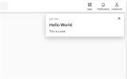
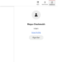
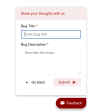
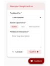

* * *

## Developers

### Component Contributors

1. Mayur Deshmukh - [mdeshmuk@redhat.com](mailto:mdeshmuk@redhat.com)

### Getting Started

SSI Service is a simple Apache Server Side Includes library that works in tandem with SPAship to provide some default templates to include in any application.

The templates include some elements like the One Platform Navbar, that houses the search, app drawer, notifications drawer and the user profile drawer.

It also includes a feedback panel button that is displayed on the bottom right corner of the screen where it allows users to provide quick feedback for a page on the app.

### Usage

#### Introduction

The SSI Service consists of 2 simple web components, which can be used or tested locally.

To do that, you need to follow the following steps

1. Clone the project from [1-platform/one-platform](https://github.com/1-Platform/one-platform)

    ```sh
    git clone https://github.com/1-Platform/one-platform
    ```

2. Change the current working directory to /packages/ssi-service

    ```sh
    cd one-platform/packages/ssi-service
    ```

3. Duplicate the `.env.example` file and name it `.env`

4. Change the APPS_BASE_API to the appropriate API Url of the API Gateway

    1. If you’re running the gateway on your local machine, then use that. Or else for development and testing of SSI, you can use the One Platform QA url ([https://qa.one.redhat.com/graphql](https://qa.one.redhat.com/graphql))

5. Run the development server

    ```sh
    npm start
    ```

6. Now to view the app in a browser, you’ll need to start the docker instance for apache. This is because the SSI service uses apache Server Side Includes to inject the SSI templates/components into the webpage. Here we’re using docker-compose. So just run the following command in a separate terminal:

    ```sh
    docker-compose up -d httpd
    ```

7. This will start the apache server in docker, and the dist directory of the ssi-service is automatically mounted as a volume inside the apache server’s webroot. So you should be able to see the app on [https://localhost:5500/](https://localhost:5500/)

To test another app with SSI Templates, all you need to do is mount the app’s dist directory to the apache webroot. To do that,

1. Open the `docker-compose.yml` file at the root of the one-platform project

2. In the volumes array of the httpd service, add another line in the following format: `<relative_path_of_your_app_dist>:/var/www/html/<app_path_url>`

 Here, the `app_path_url` should be the route/subroute of your app.

For example:

```sh
services:
 httpd:
   image: spaship/httpd:latest
   ...
   volumes:
     ...
     - <path_of_the_app_dist>:/var/www/html/my-app
   ...
```

### Supported Features

1. Navbar

    The Navbar (or op-nav) is a web component that acts as the global navigation menu and header for One Platform. It consists of an App Drawer, Notification Drawer, User Profile Drawer, and a Search Bar.

2. Feedback Panel

    The Feedback Panel (or op-feedback-panel) is a web component that acts as the common feedback collection form for the entire One Platform. It allows users’ to submit bug reports, feature requests and share their overall experience with any app on the Platform, or even the platform as a whole.

#### Apps using this Service

All the in-built apps of One Platform use these SSI Components, and it is also useful for any external app, as it helps the user find any navigate through the Platform easily.

Some examples are:

1. Home SPA
2. User SPA
3. Analyst Papers SPA
4. MOD Handover SPA, etc

### Other Details Pages

#### App Drawer



#### Notification Drawer

* Notifications Drawer
    
* Notifications Pop Up
    

#### User Profile Drawer



#### Feedback Panel

* Feedback Pop-Up
    
* Bug Report
    
* Share Feedback
    

## API Reference

Along with the web components, the SSI Templates also inject certain helper functions in the document window.

<table>
  <tr>
    <td>OpAuthHelper</td>
    <td>getUserInfo(): User</td>
    <td>Returns an object with the details of the logged in user.</td>
  </tr>
  <tr>
    <td></td>
    <td>onLogin(cb: function)</td>
    <td>Takes in a callback function, which is called when the user logs in successfully.
It passes the user details as an argument to the callback function</td>
  </tr>
  <tr>
    <td>OpNotification</td>
    <td>showToast(notification, options)</td>
    <td>Triggers a new pop-up notification.
The arguments include a notification object with details of the toast, like subject, body, etc.
And an optional options object which can be used to provide the toast duration, etc.</td>
  </tr>
</table>

## FAQs

* **What is SSI Service? And what does SSI Stand for?**

    SSI Service/Templates is a set of global templates for One Platform. It provides useful web components as a "server side include" templates. Here the SSI Stands for Server Side Includes (derived from Apache’s SSI)

* **How can I use the SSI components in my app?**

    To include the SSI components in your app, you just need to add a line of code to your html files: (This adds the default navbar and feedback panel to your app)

    ```html
    <head>
        <!--#include virtual="/.ssi/nav/default.html" -->
    </head>
    ```

* **Can I create my own SSI Template? Or can I customize the defaults?**

    Currently we only have the default/non-customizable components. But we’re working on making it more flexible and customizable. So look forward to that in the future.
