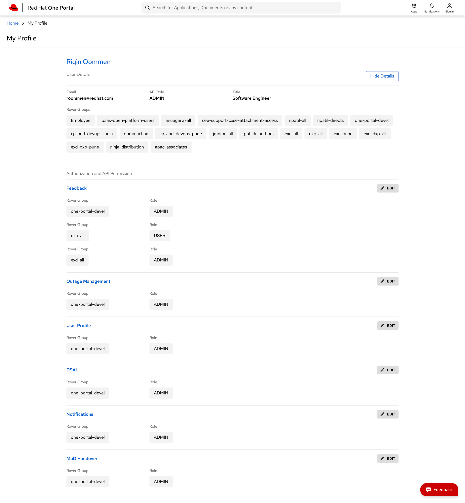

* * *

## Developers

### Component Contributors

1. Rigin Oommen - [roommen@redhat.com](mailto:roommen@redhat.com)

## Getting Started

User SPA represents the user information to the logged in user. This is an integral part of the One Platform. Permissions and privileges assigned to a specific user are represented here.

## Usage

### Introduction

This SPA is integrated with the User and Home Microservices for getting the permissions and the user data. It allows users to map the user permissions with other SPAs. This is built with Angular.

### Supported Features

1. Permission Management: Logged in users are able to see the permissions which are assigned to their profiles.

2. User Profile view

### Microservices used by this SPA

1. Home Microservice

2. User Microservice

### Quick Start Guide

**Prerequisites**

1. **NodeJS**  should be installed (*version>=**v10.15.3*)
2. **NPM** should be installed *(version>=**6.4.1**)*
3. Version control system required. Preferably **git**.
4. **Angular CLI** needs to be installed

**Steps**

1. Clone the [repository](https://github.com/1-Platform/one-platform).

 ```sh
 git clone git@github.com:1-Platform/one-platform.git
 ```

2. Switch the working directory to the user  microservice

 ```sh
 cd one-platform/packages/user-profile-spa
 ```

3. Install the dependencies.

 ```sh
  npm i
 ```

**Start**

1. Run npm run start to run your spa for dev env
2. Navigate to port 4200 to see the running app.
 eg: `http://localhost:4200`

**Build**

1. [Webpack](https://webpack.js.org) is used for the build system in the microservices.
2. Run npm run build to generate a build

**Testing**

1. For testing microservice with [jest](https://jestjs.io/) with the preconfigured settings.
2. Execute the command for testing.

 ```sh
 npm run test
 ```

### Screenshots


