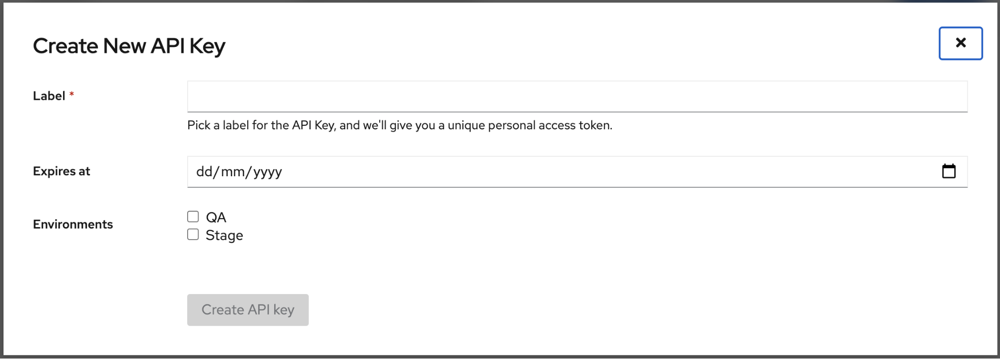
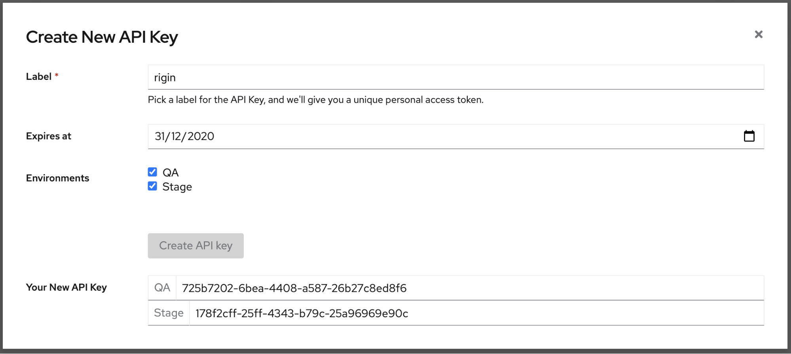

* * *

## SPA Developers Guide

### Prerequisites
  - [**NodeJS**](https://nodejs.org/en/)  should be installed (*version>=v10.15.3*)
  - [**NPM**](https://www.npmjs.com/get-npm) should be installed *(version>=6.4.1)*

### Deploying to One Platform
  #### Setting up the SPAship CLI.
- SPAship is an open source platform for deploying, integrating, and managing single-page apps (SPAs).
- SPAship have a CLI client which enables to push the SPA to the specified environments.

```sh
npm install -g @spaship/cli
```
#### Acquiring an API Key.
  - Navigate to SPAship Hosted URL>/authentication/apikeys
  - Click on the Create API Key button. A modal will popup.



- Set the Label, API Key Expiry Date and mark the environments that the key needs to be enabled and press the Create API Key button.



- API Key has generated for the specified environments and you need to copy the key instantly because you won't be able to see the key for next time.

#### Configuring spashiprc.yaml.
  - Create .spashiprc.yaml in the home folder and add the api keys and SPAship urls.  Based on the SPAship Instances QA and Stage environment urls also need to be included.

```sh
$ cat ~/.spashiprc.yml
envs:
  qa:
    url: https://op-spaship-qa-api.cloud.paas.psi.redhat.com
    apikey: v1833557-d45b-4729-8c12-bdda62d31133
  beta:
    url: https://op-spaship-api.cloud.paas.psi.redhat.com
    apikey: 3391f3l8-571s-4c70-a0f5-dea105e94556
```

#### Using the Spaship deploy command.
  - SPAship allows the user to deploy the packaged version of the SPA build. Based on the Technology stack you use to build the SPA generate the build accordingly.
  - Execute spaship init command to include the spaceship configuration on build
  - Switch the working directory into the *dist* folder. Pack the dist folder of SPA using zip utility.

`zip spa.zip .`

- Deploy the SPA using Spaship deploy command.

`spaship deploy Archive.zip --env=dev`

#### Setting up a CI script for automating the deployment process.
  - There is a [script](https://raw.githubusercontent.com/1-Platform/one-platform/master/deploy.sh) available for deployment of SPA build. You can add this in the project root folder and execute the script to generate the package and deploy in the SPAship environments.

`./deploy.sh spa <spaname> /<spa-url> <env> <version>`

Example - `./deploy.sh spa mod-spa /mod qa 0.1.0`
#### Validating the deployment.
  - If the deployment is a success you will get an acknowledgement like below.
```sh
Deploying SPA to qa (https://op-spaship-qa-api.cloud.paas.psi.redhat.com)
✔ The file op-search.zip deployed successfully !
Upload file tooks 5 seconds
Process file tooks 9 seconds
Total: 14 seconds
{ status: 'success',
  data:
   { name: 'op-search',
     path: '/search',
     ref: '1.0.0',
     timestamp: '2020-10-08T07:16:58.530Z' } }
```

### SSI Implementation
  - #### Including the One Platform SSI script in your application.
    - Following SSI Code snippet is a universal web property for using the SSI with the SPA. This needs to be injected with the root of your spa inside the <body></body> tag.

```html
<!-- SSI Include Snippet -->
<!--#include virtual="/.ssi/nav/default.html" -->

```
- Angular  - index.html.
- React - index.html.
- VueJS - index.html

#### Utilizing One Platform’s user-group service.
  - For using the user group microservice environment variables needs to be configured
  - Copy the .env.example file in the root directory as .env file.

## GitHub Repo

[https://github.com/1-Platform/one-platform](https://github.com/1-Platform/one-platform)
