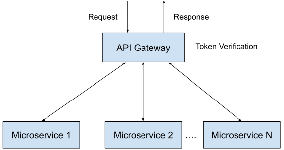

* * *

## Developers

### Component Contributors

1. Mayur Deshmukh  - [mdeshmuk@redhat.com](mailto:mdeshmuk@redhat.com)
2. Rigin Oommen - [roommen@redhat.com](mailto:roommen@redhat.com)

## Getting Started

Authorization is important for any service. In One Platform we included this for ensuring the access controls across the platform This has been implemented with support of Red Hat SSO.

## Usage

### Introduction

Every SPA/Microservice can use the authorization feature for ensure that right user is using the right thing

#### Apps using this feature

1. Notifications
2. Feedback
3. Home SPA
4. User Profile

### SSI (Server Side Includes)

SSI  integrated with the Red Hat SSO which initiates the login process and obtains jwt token after successful login.

After getting the token and the user data it is saved to the local storage.

### API Gateway

API gateway which is built with graphql which performs token verification associated with every XHR request. API gateway verifies the token with the public key of Internal IDP. If the token is valid then gateway will route the request to the specified microservice.

If a request get authenticated successfully the decoded payload will be passed to the specified microservice. The decoded payload consists of the user information.

### Directives

Directives are special annotations that developers can use to Change/Extend behaviour for selected elements in the schema. We are willing to use this for the SPA/Microservice permissions
