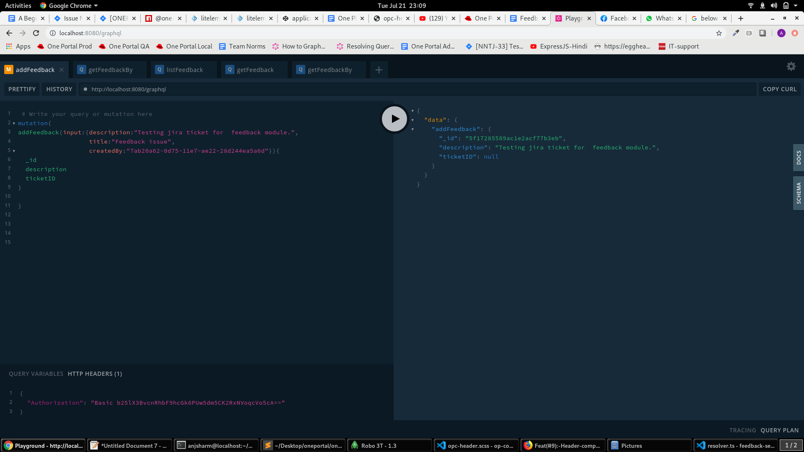
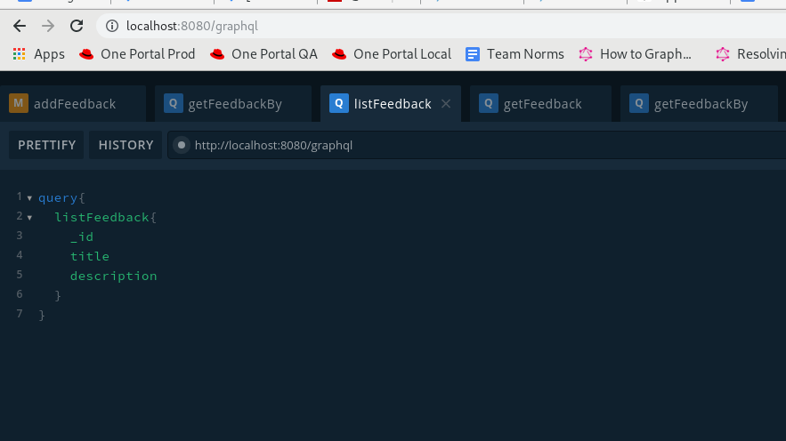
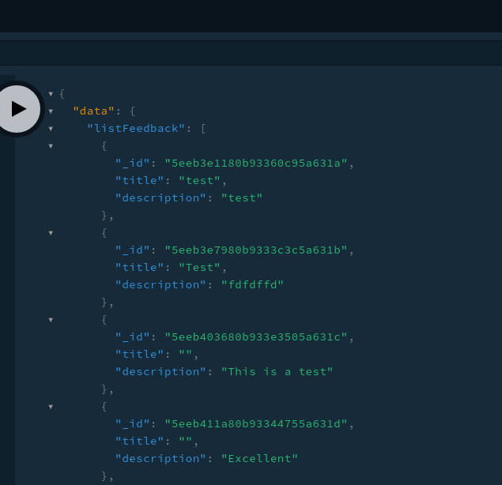
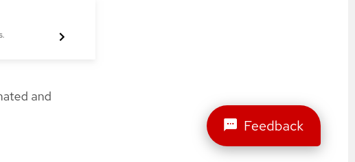
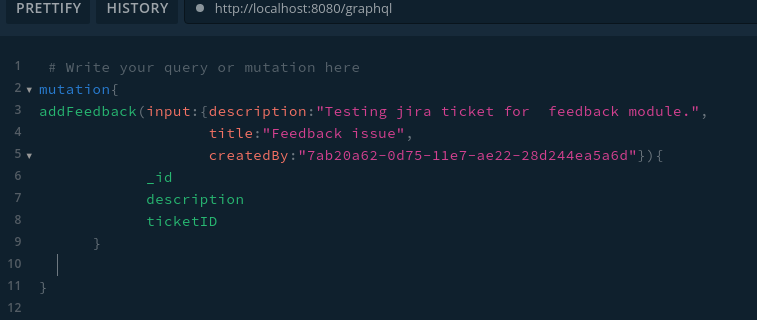
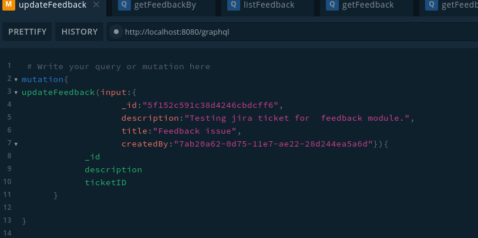
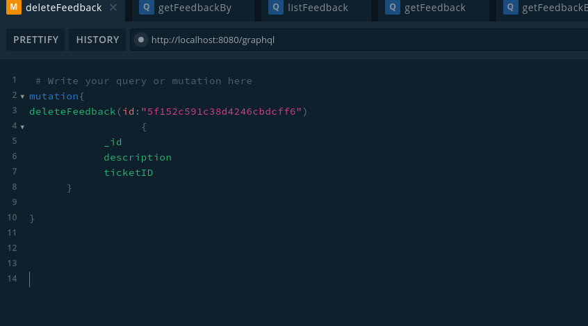
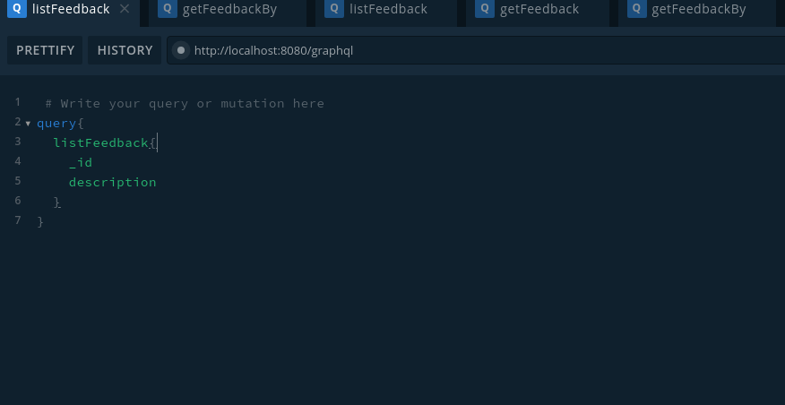
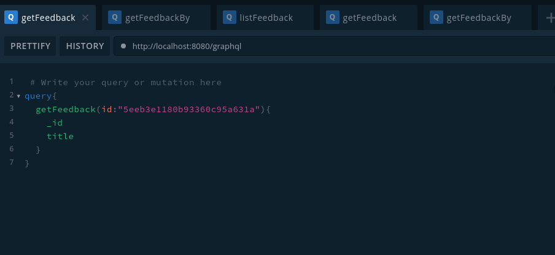

***

## Developers

### Component Contributors

1. Anjnee Sharma - [anjsharm@redhat.com](mailto:anjsharm@redhat.com)   <https://github.com/anjneeksharma>

## Getting Started

Feedback microservice is accessible from graphql playground with authorization header but in case of production playground is disabled.

To access it in local system:

1 Clone it from one portal git repo if it's not available in the local system.

2 cd  one-platform/packages/feedback-service

3  Run `npm run build:dev` to generate build.

4  Run `npm run start`

5  access it in browser [http://localhost:8080/graphql](http://localhost:8080/graphql)

6 Now you can access all graphql endpoints.

For details users can access the `DOCS` and `SCHEMA` options in the upper right corner of the playground.

## Usage

### Introduction

One Platform's server-side Feedback GraphQL Microservice allows users to talk to the feedback database and can perform operations like addfeedback, updatefeedback, deletefeedback and listfeedback.

### Supported Features

1. addFeedback
2. updateFeedback
3. deleteFeedback
4. Listfeedback
5. getFeedbackById
6. getFeedbackBy

Add feedback example

#### Apps using this microservice

1. Home
2. API Gateway
3. SSI
4. User
5. Feedback
6. Notifications

### Quick Start Guide

 Follow below steps to set up a feedback service.

1. Git clone/download zip ([https://github.com/1-Platform/one-platform.git](https://github.com/1-Platform/one-platform.git))
2. Install all the dependency (npm install)
3. Run it (npm run start)
4. Access it from GraphQL Playground ([http://localhost:8080/graphql](http://localhost:8080/graphql))
5. Refer below screenshot for graphql endpoint access
    

    Result is as below

    

Note: For more details refer the `docs` and `schema` options in right upper corner of GraphQL Playground.

## Other Details Pages

You would also need to build and start user-service as well because feedback fetch user information from  user-service.

1. `cd one-platform/packages/user-service`
2. `npm install`
3. `npm build:dev`
4. `npm run start`

## FAQs

* **Is the feedback module used only for giving feedback ?**

    No, using the feedback module we can give feedback and also report bugs.

* **Who can give feedback ?**

    Any user who can login to one.portal.redhat.com can give feedback

* **How can we create a bug report?**

    Login to One Portal to find the feedback button to the bottom right corner
    

* **How can I get my feedback status?**

    Go to feedback listing page [https://one.redhat.com/feedback/](https://qa.one.redhat.com/feedback/) there feedback can be search many ways

* **How does the feedback module handle feedback/bugs internally?**

    Create a jira ticket on a one-portal jira board someone from the team will pick it and start working.

* **Is there any plan to improve the existing feedback module ?**

    Yes, we are working with stakeholders as per requirement it will be customized.

## API Reference

**AddFeedback:** add new feedback

**updateFeedback:**- update existing feedback.

**deleteFeedback:** it will delete existing feedback.

**listFeedback:**  It will list feedback.

**getFeedback:** get the feedback based on its id

**getFeedbackBy:** get feedback by any of its properties like id, title, description for more detail refer docs in graphql playground.

## Target Users

This docs is meant for developers as well end users.

## Applications (SPAs)

It is used by the feedback-spa for listing feedback and adding feedback
