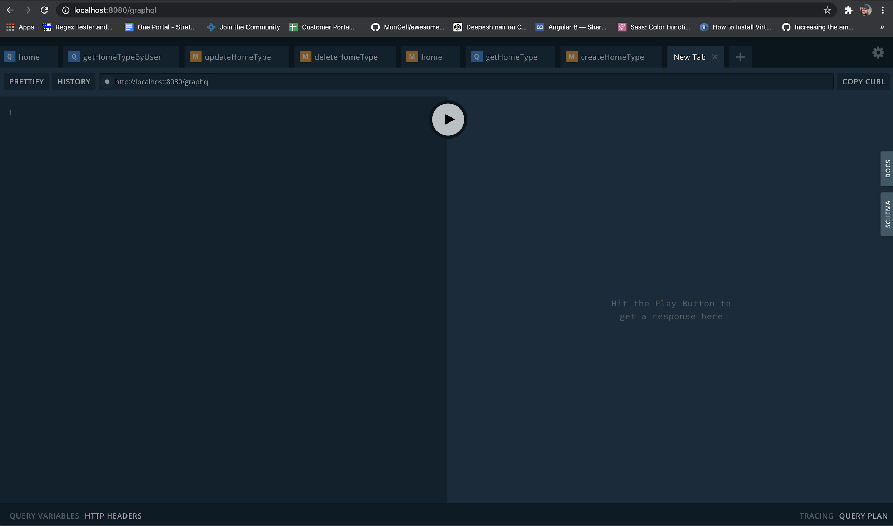

***

> This service is being deprecated, and the related APIs will be removed soon. Please see apps-service for the updated APIs.

## Developers

1. Deepesh Nair - [denair@redhat.com](mailto:denair@redhat.com)

## Getting Started

The Home SPA needs a backend API Service to fetch the SPA/Microservice details and the Apps. This microservice saves any such information about all the SPAs / Microservices which are maintained on the Platform.

## Usage

* The home-service has the following schema (mongoose - mongodb)

  ```js
   name: String,
   description: String,
   link: String,
   icon: String,
   entityType: String,
   colorScheme: String,
   videoUrl: String,
   owners: [String],
   createdBy: String,
   createdOn: Date,
   updatedBy: String,
   updatedOn: Date,
   active: Boolean
   permissions: [
       {
           roverGroup: String,
           role: {
               type: String,
               enum: ['ADMIN', 'USER'],
               required: true,
           }
       }
   ],
   ```

## Running a local Development Server

* Clone the entire project from  [https://github.com/1-platform/one-platform](https://github.com/1-platform/one-platform)

  ```sh
  git clone git@github.com:1-Platform/one-platform.git
  ```

* You will have to run two servers locally because home-service is dependent on user-server to get User Information. Go to both the respective folders and run both of them locally. Also make sure that you have the necessary environment variables in the `.env` file

* Environment File example

```js
NAME=local
NODE_ENV=local
PRODUCTION=false
```

## Server URLs

```js
API=<https://localhost:8080>
GRAPHQL_API=<https://localhost:8080/playground>
```

## Database mongodb

```js
DB_PATH=localhost
DB_NAME=one-platform
```

## Certificate Configuration

```js
SSL_KEY=/etc/pki/tls/private/server.key
SSL_CERT=/etc/pki/tls/certs/server.crt
```

## User-Service API

```js
USER_SERVICE_SERVICE_HOST=localhost
USER_SERVICE_SERVICE_PORT=8083
```

* Terminal 1

  ```sh
  cd one-platform/packages/user-service/
  PORT=8083 npm run start
  ```

* Terminal 2

  ```sh
  cd one-platform/packages/home-service/
  npm run start
  ```

* You should now be able to access the playground at [https://localhost:8080/graphql](https://localhost:8080/graphql)

  

* To run test keep the user-service running and export the following:

  ```js
  export DB_PATH=localhost
  export DB_NAME=test-one-platform
  export USER_SERVICE_SERVICE_HOST=localhost
  export USER_SERVICE_SERVICE_PORT=8083
  ```

  * Then run the following:

  ```sh
  npm run test
  ```

## Apps using this microservice

1. SPAs
    * Home
    * Notifications
    * User Profile
2. Microservices
    * Notifications-Service

## API Reference

Following are the APIs that are used in the home-service. Home service internally uses user-service to get user information (createdBy, updated By, Owners)

Following are graphql types.

* Input and Output for HomeType
  * Output

  ```js
  type HomeType {
    _id: String
    name: String
    description: String
    link: String
    icon: String
    entityType: String
    colorScheme: String
    videoUrl: String
    owners: [HomeUserType]
    createdBy: HomeUserType
    createdOn: DateTime
    updatedBy: HomeUserType
    updatedOn: DateTime
    active: Boolean
    permissions: [PermissionsType]
  }
  ```

  * Input

  ```js
  input HomeInput {
    _id: String
    name: String
    description: String
    link: String
    icon: String
    entityType: String
    colorScheme: String
    videoUrl: String
    owners: [String]
    createdBy: String
    createdOn: DateTime
    updatedBy: String
    updatedOn: DateTime
    active: Boolean
    permissions: [PermissionsInput]
  }
  ```

* Types mentioned above:

  ```js
  type PermissionsType {
    roverGroup: String
    role: APIROLE
  }
  ```

  ```js
  enum APIROLE {
    ADMIN
    USER
  }
  ```

  ```js
  type HomeUserType {
    _id: String
    name: String
    title: String
    uid: String
    rhatUUID: String
    memberOf: [String]
    isActive: Boolean
    apiRole: APIROLE
    createdBy: String
    createdOn: DateTime
    updatedBy: String
    updatedOn: DateTime
  }
  ```

* To list all the HomeType (.i.e. microservices /SPAs)

  ```js
  listHomeType: [HomeType]
  ```

* To get a particular HomeType by $id

  ```js
  getHomeType(_id: String!): HomeType
  ```

* Get HomeType by any of the HomeType

  ```js
  getHomeTypeBy(input: HomeInput): [HomeType]
  ```

* Get HomeType by user

  ```js
  getHomeTypeByUser(rhuuid: String!): [HomeType]
  ```

* Create HomeType

  ```js
  createHomeType(input: HomeInput): HomeType
  ```

* Update HomeType requires $id field to update the particular HomeType

  ```js
  updateHomeType(input: HomeInput): HomeType
  ```

* To remove HomeType -  Required $id to delete the HomeType

  ```js
  deleteHomeType(_id: String!): HomeType
  ```

## Target Audience

* SPA Developers for One Platform

* SPA Owners for One Platform

* SPA Users for One Platform

## FAQs

* **What is home-service?**

  Home-Service is a microservice which stores information about all SPAs/Microservices which are hosted/deployed on One Platform.
