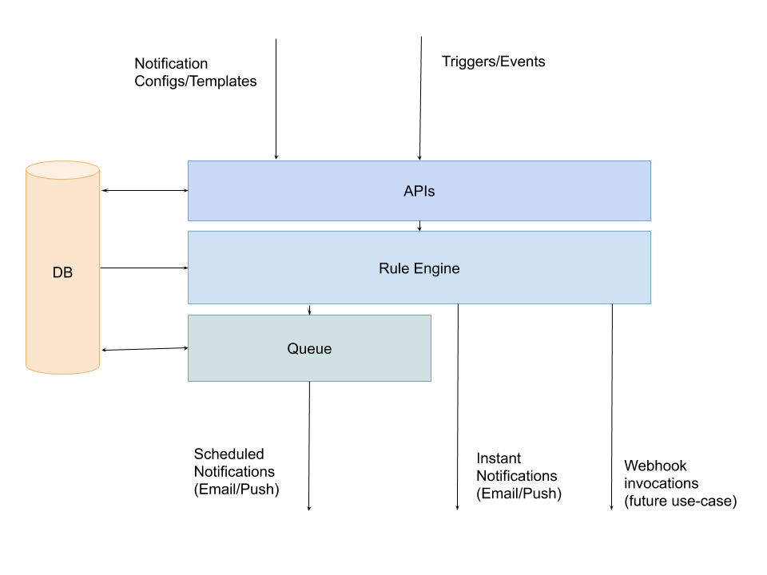

***

## Developers

### Component Contributors

1. Mayur Deshmukh - [mdeshmuk@redhat.com](mailto:mdeshmuk@redhat.com)
2. Diwanshi Pandey - [dpandey@redhat.com](mailto:dpandey@redhat.com)

## Getting Started

Notifications Microservice provides the essential GraphQL APIs required for the Notifications Framework. It includes graphql queries for configuring notifications, triggering notifications, listening for notifications, etc.

## Usage

### Introduction

Any developer can use the Notification Microservice to utilize/implement notifications in their App. They just have to create a notification config, and they can start sending or listening to notifications using the GraphQL APIs and Subscriptions.

### Supported Features

1. Email Notifications
2. Push/Pop-up Notifications (Using GraphQL subscriptions)
3. Webhooks (coming soon)

#### Apps using this microservice

1. Feedback

### Quick Start Guide

To get started with the Notifications Microservice, and to use it in your own apps, you can follow the following steps:

1. Create a notification config for your app from the One Platform Notifications Dashboard ([https://beta.one.redhat.com/notifications](https://beta.one.redhat.com/notifications))
2. Fill out the Notification Config form using the appropriate fields as are required for your use case.
3. Once the notification config has been created, you will get a unique configID. You can use this configID to send and receive notifications for your app.
4. To send a notification, you can use the existing GraphQL mutation newNotification to trigger a notification.
5. For example, if you want to send out a notification, when the document is created in your app, you can simply call the GraphQL mutation and pass it the required data, such as the subject, body, etc. and the Notifications Microservice will send out the notification via the appropriate channels to the target/end-users.
    1. If the notification config was created for email notifications, then the notification will be sent out as an email.
    2. If the notification config was created for Push or Banner notifications, then the notification will be sent out as a GraphQL subscription.
6. One Platform’s default navbar by default listens to all kinds of Push and Banner notifications for the respective logged in user. So any notification that is sent from your app for that user will be displayed to that user in the form of a pop-up in the UI, and also shown in the Notification Drawer.
7. If you want to listen to the notifications in your app, for example to perform some custom actions, you can use any GraphQL subscriptions client library to connect to the Notifications Microservice subscriptions API, using the subscription newNotifications and pass it the target that you want to listen to, and it will be triggered whenever a notification for that target is sent out.

## API Reference

Endpoint: [https://api.beta.one.redhat.com/graphql](https://api.beta.one.redhat.com/graphql)

Notifications Microservice provides a set of GraphQL Queries and Mutation APIs to allow developers to create, edit, delete their Notification Configs and Notifications.

### GraphQL Queries

<table>
  <tr>
    <td>listActiveNotifications</td>
    <td>Returns a list of Active Notifications.
It accepts a parameter "limit", to restrict the number of notifications in the response.
(The default limit is 25)</td>
  </tr>
  <tr>
    <td>listArchivedNotifications</td>
    <td>Returns a list of the old/archived notifications.
It accepts a mandatory parameter “targets” which can be used to get the notifications for the provided targets.
It also accepts a parameter “limit”, to restrict the number of notifications in the response.
(The default limit is 25)</td>
  </tr>
  <tr>
    <td>getNotificationsBy</td>
    <td>Returns notifications matching the given selection criteria.
It accepts a parameter “selector” of type NotificationPayloadInput.</td>
  </tr>
  <tr>
    <td>listNotificationConfigs</td>
    <td>Returns a list of all the NotificationConfigs</td>
  </tr>
  <tr>
    <td>getNotificationsConfigsBy</td>
    <td>Returns all the NotificationConfigs matching the given parameter “notificationConfig”</td>
  </tr>
  <tr>
    <td>getNotificationConfigByID</td>
    <td>Finds a NotificationConfig by ID</td>
  </tr>
</table>

### GraphQL Mutations

<table>
  <tr>
    <td>newNotification</td>
    <td>Creates a new notification and add it to the queue</td>
  </tr>
  <tr>
    <td>createNotificationConfig</td>
    <td>Creates a NotificationConfig from the given input object</td>
  </tr>
  <tr>
    <td>updateNotificationConfig</td>
    <td>Patches the given NotificationConfig Object</td>
  </tr>
  <tr>
    <td>deleteNotificationConfig</td>
    <td>Removes the NotificationConfig matching the given ID</td>
  </tr>
</table>

### GraphQL Subscriptions

<table>
  <tr>
    <td>newNotifications</td>
    <td>A GraphQL subscription that establishes a socket connection with the Server.
An event is sent to the client whenever a new notification is triggered.
It accepts a "targets" parameter to filter and listen to the notifications for the specified targets.</td>
  </tr>
</table>

## FAQs

* **What kind of Notifications are supported by the Notifications Microservice?**

  Email, Push and Banner. Webhooks will be added soon.

* **Do I have to create a Notification Config to use the Notifications Microservice?**

  Yes. The Notification Config helps you define the defaults and allows the Notifications Rule Engine to determine where and how the Notification should be sent.

* **How does the Notifications microservice work?**

  The Notifications Microservice consists of 3 main components.
  1. APIs
  2. Rule Engine
  3. Queue / Scheduler

* **Architecture Diagram of the Notifications Microservice**
  
